# Airport-API-Service 

Welcome to the Airport Service API! Best solution for managing flight orders, routes, planes, tickets ordering and more. Airport Service API suites both developers integrating airport management infrastructure or airline company in need of efficient system to handle reservations and flights .

___

## Airport Service DB Structure

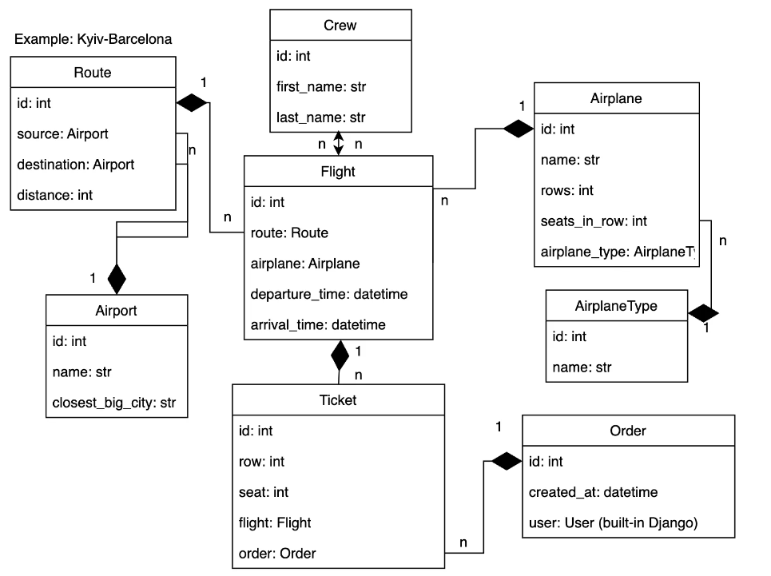

## Features


* ___Tickets Ordering ___: Users can easily order tickets for their desired flights.
* ___Flight Management___: Administrators can add new flights to the system and manage existing ones. 
* ___Authentication and Permissions___: The API is secured with JWT authentication using the Django Rest Framework (DRF).
* ___Filtering and Pagination___: The API supports filtering of flight, airports, airplanes and crew. Even more, pagination is implemented to efficiently manage large sets of data.
* ___API Documentation___: The API documentation is automatically generated using DRF Spectacular. It provides a clear overview of available endpoints, request parameters, response formats, and authentication requirements.
* ___User Order Management___: Users can only view and manage their own orders. The API enforces this restriction in order to ensure privacy and security of data.
* ___Preloaded data for better first time experience___: API is presented with preloaded data. It will allow you to test all functionality of API.
___

## Prerequisites
Following prerequisites need to be installed on your system:

* ___Docker___: You can download and install Docker from the official website: https://www.docker.com/.
* ___ModHeader___: You can download and install ModHeader from the official website: https://modheader.com/.


## How to use

### Easy and quick way

Follow the link [Airport Service API](https://airport-service-api-v9qf.onrender.com)

### More complex but full of fun way

#### Working with git repository

To set up the Airport Service API, follow these steps:

1. Clone the repository:
    ```
    git clone https://github.com/Naz-iv/airport_api_service.git
    ```
2. Navigate to Project Directory: Change into the project directory using the following command:
    ```
    cd airport_api_service
    ```
3. Build and Run Docker Container: Use Docker Compose to build the API's Docker container and start the API server:
    ```
    docker-compose build
    docker-compose up
    ```

#### Working with Docker Hub

To set up the Airport Service API, follow these steps:

1. Pull image from Docker Hub:
    ```
    docker pull nivankiv/airport_api_service-app:latest
    ```
2. Run Docker Container:
    ```
    docker-compose up
    ```

##### When Git API project of Docker Hub image is ready for user:

You need to generate access token. Do to: ``127.0.0.1:8000/api/users/token``

To use servie as admin enter following credentials:
- login: ``admin@admin.com``
- password: ``1qazcde3``

To use servie as user enter following credentials:
- login: ``user@user.com``
- password: ``1qazcde3``

After logging in with provided credentials you will receive two tokens: access token and refresh token.
Add new request headed and enter information:

Name: ``Authorization``

Value: ``Bearer_space_*your_access_token*`` 

Access token example. ``Bearer dmwkejeowk.ewkjeoqdowkjefowfejwefjwef.efhnwefowhefojw``

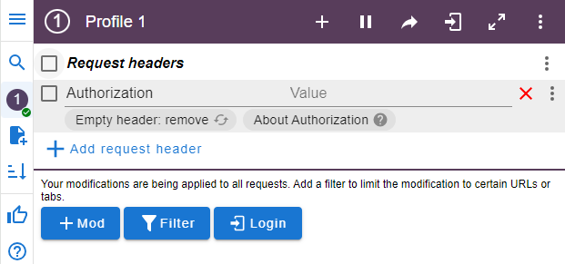

Go to ``127.0.0.1:8000/api/flight_service/`` and discover all hidden gems


## Conclusion

Thank you for using the Airport Service API! 

## Screenshots

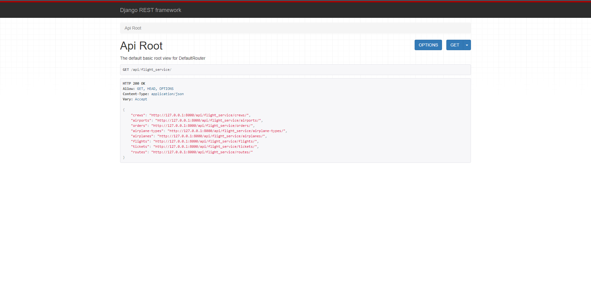
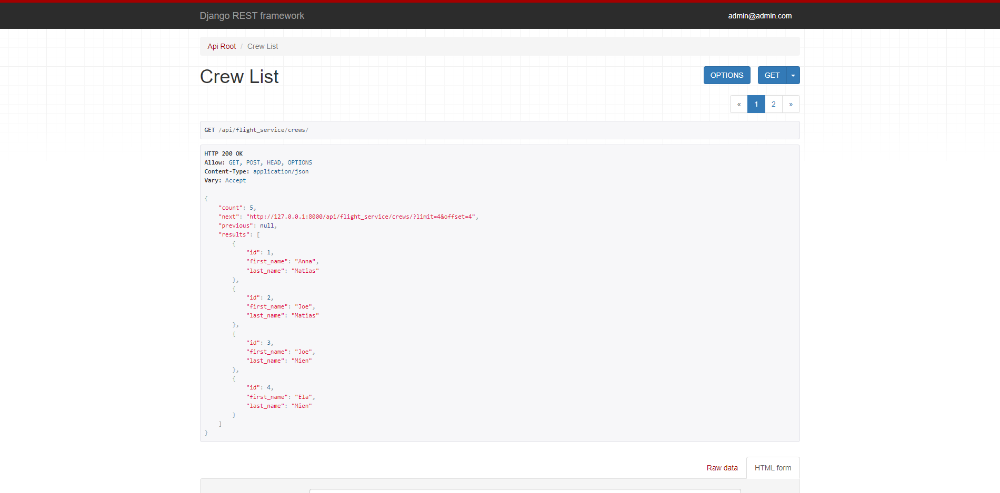
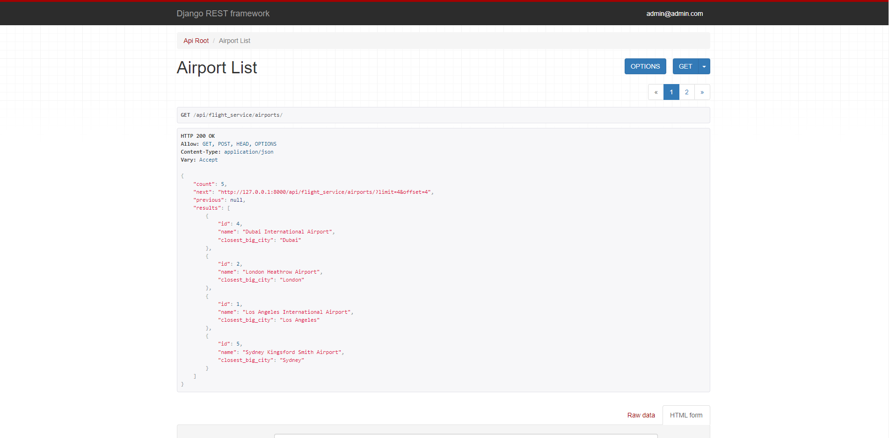
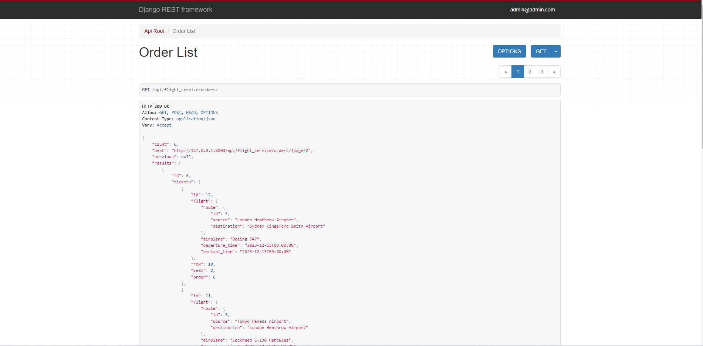
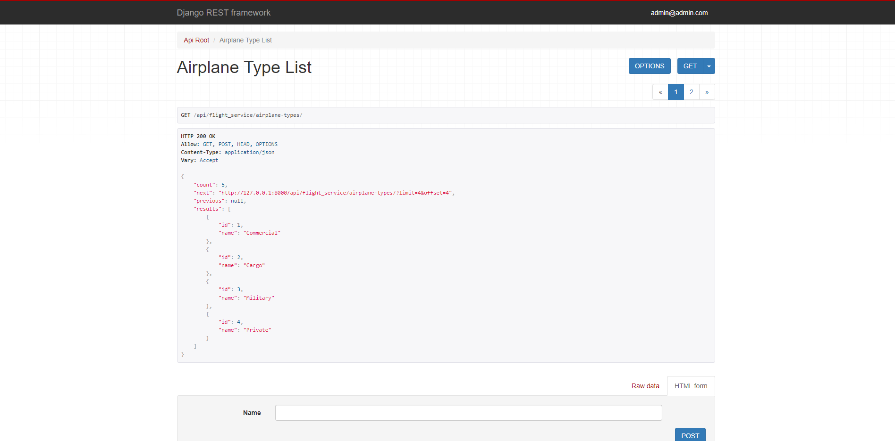
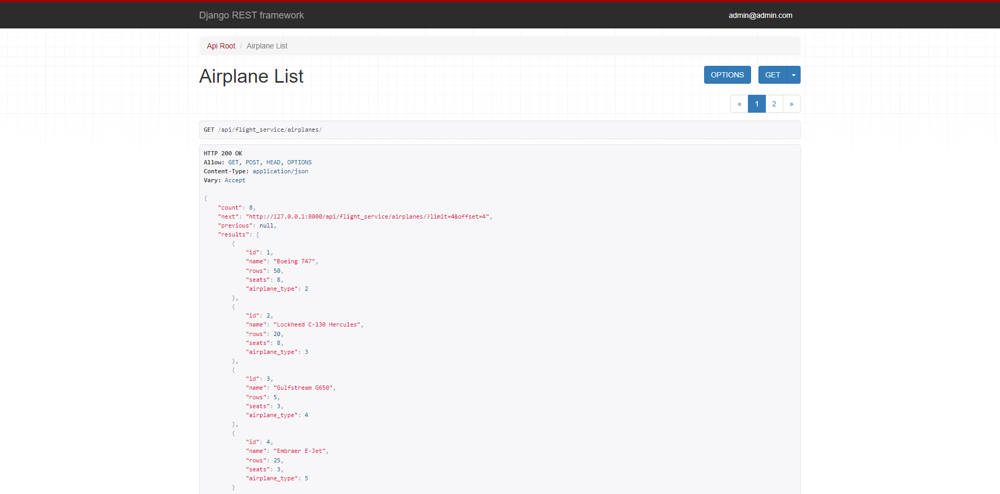
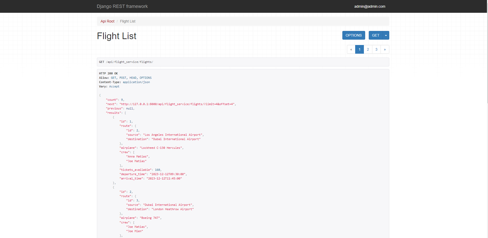
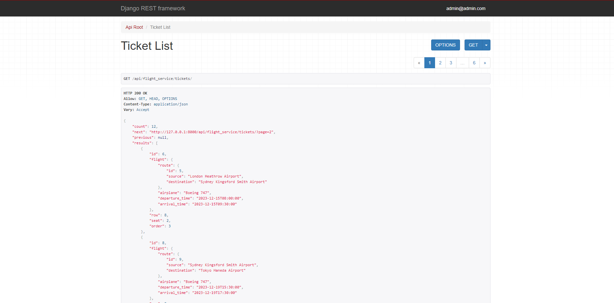
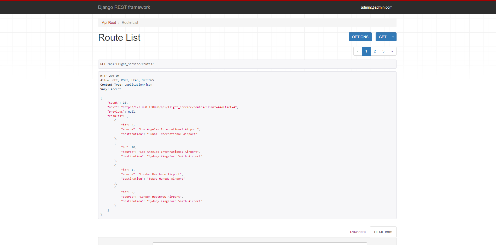
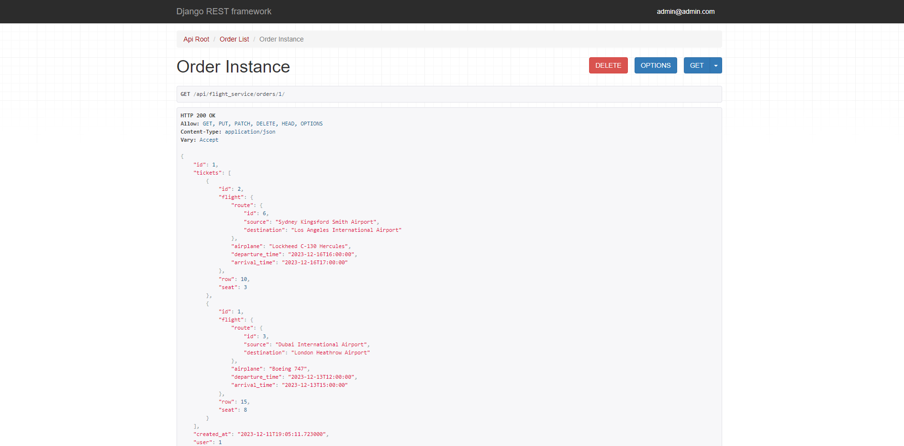
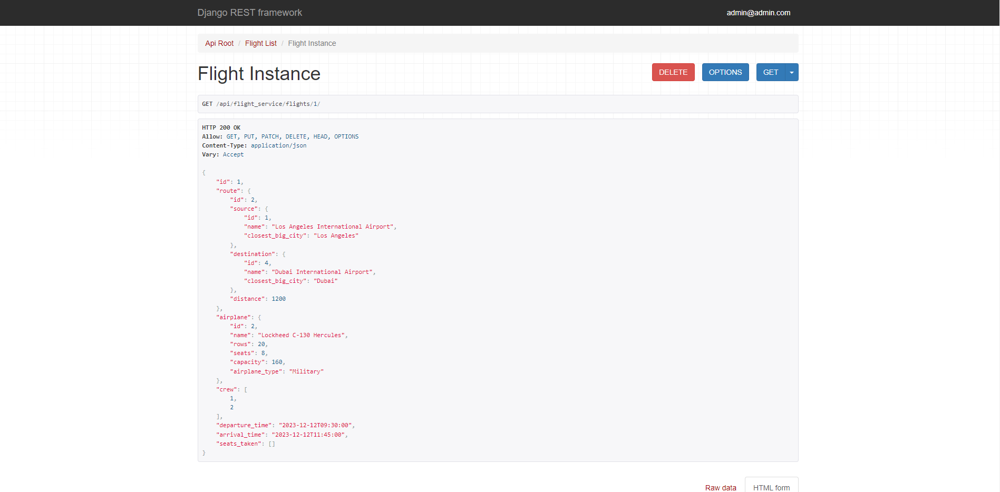
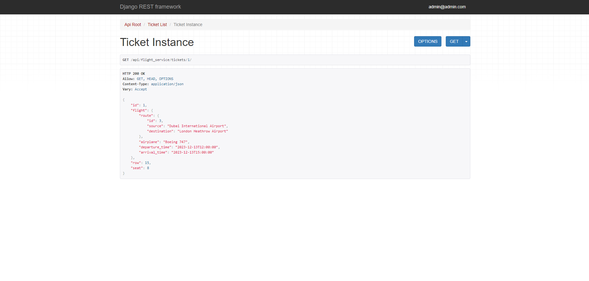
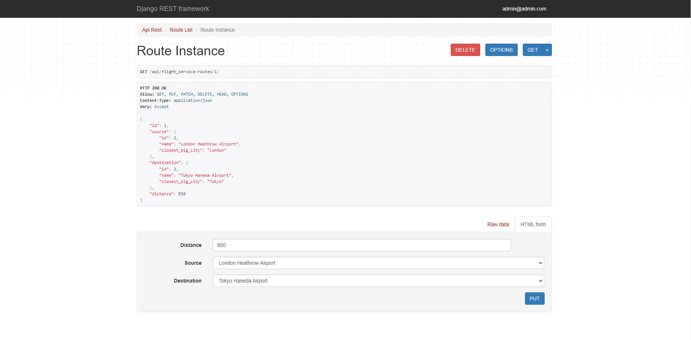
